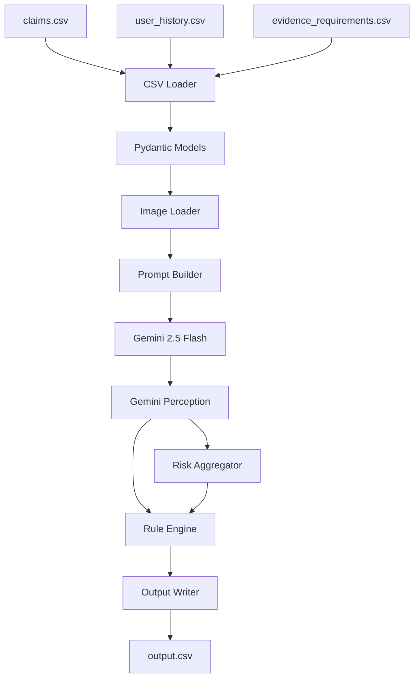

# HackerRank Orchestrate — Multi-Modal Evidence Review

A production-ready system that verifies damage claims using submitted images, claim conversations, user history, and evidence requirements.

**Supported object types:** `car`, `laptop`, `package`

---

## Table of Contents

* [Problem Statement](#problem-statement)
* [Architecture](#architecture)
* [Repository Structure](#repository-structure)
* [Setup](#setup)
* [Running the Pipeline](#running-the-pipeline)
* [Running Evaluation](#running-evaluation)
* [Output Schema](#output-schema)
* [Design Decisions](#design-decisions)
* [Known Limitations](#known-limitations)

---

## Problem Statement

For each claim in `dataset/claims.csv`, the system:

1. Extracts the actual damage claim from a customer conversation
2. Inspects submitted images using a vision model
3. Determines whether evidence requirements are met
4. Identifies visible damage type and affected object part
5. Classifies the claim as:

   * `supported`
   * `contradicted`
   * `not_enough_information`
6. Detects image quality and fraud-related risks
7. Estimates damage severity
8. Produces a final `output.csv`

---

## Architecture



### Key Design Decisions

* Gemini performs **perception only**
* Python rule engine performs **all business decisions**
* One Gemini API call per claim
* Deterministic outputs using:

  * `temperature=0.0`
  * JSON responses
  * Rule-based post-processing

---

## Repository Structure

```text
.
├── AGENTS.md
├── problem_statement.md
├── README.md
├── STATUS.md
├── output.csv
├── .env.example
├── requirements.txt
│
├── code/
│   ├── main.py
│   ├── models.py
│   ├── config.py
│   │
│   ├── services/
│   │   ├── csv_loader.py
│   │   ├── image_loader.py
│   │   ├── prompt_builder.py
│   │   ├── gemini_client.py
│   │   ├── risk_aggregator.py
│   │   ├── rule_engine.py
│   │   └── output_writer.py
│   │
│   └── evaluation/
│       ├── main.py
│       ├── metrics.py
│       └── evaluation_report.md
│
└── dataset/
    ├── sample_claims.csv
    ├── claims.csv
    ├── user_history.csv
    ├── evidence_requirements.csv
    │
    └── images/
        ├── sample/
        └── test/
```

---

## Setup

### Prerequisites

* Python 3.11+
* Gemini API Key

### Installation

```bash
git clone git@github.com:interviewstreet/hackerrank-orchestrate-june26.git

cd hackerrank-orchestrate-june26

python -m venv .venv

source .venv/Scripts/activate

pip install -r requirements.txt
```

### Environment Variables

Create `.env`:

```env
GEMINI_API_KEY=your_api_key_here
```

**Important:** Never commit `.env` files.

---

## Running the Pipeline

```bash
python code/main.py
```

The pipeline:

1. Loads claims
2. Loads images
3. Calls Gemini
4. Runs deterministic rule engine
5. Generates `output.csv`

Example logs:

```text
=== Evidence Review Pipeline Starting ===

Loaded 46 claim(s)

[1/46] Processing claim user_002 ...

...

=== Pipeline Complete ===

Succeeded: 46
Failed: 0
```

---

## Running Evaluation

```bash
python code/evaluation/main.py
```

Outputs:

* Field-level accuracy
* Strategy comparison
* Prediction export

Generated file:

```text
code/evaluation/sample_predictions.csv
```

---

## Output Schema

| Column                       | Description             |
| ---------------------------- | ----------------------- |
| user_id                      | User identifier         |
| image_paths                  | Submitted image paths   |
| user_claim                   | Original customer claim |
| claim_object                 | car / laptop / package  |
| evidence_standard_met        | Boolean                 |
| evidence_standard_met_reason | Explanation             |
| risk_flags                   | Detected risks          |
| issue_type                   | Damage category         |
| object_part                  | Damaged component       |
| claim_status                 | Final decision          |
| claim_status_justification   | Supporting explanation  |
| supporting_image_ids         | Evidence images         |
| valid_image                  | Boolean                 |
| severity                     | Damage severity         |

### Allowed Claim Status

* `supported`
* `contradicted`
* `not_enough_information`

### Allowed Severity

* `none`
* `low`
* `medium`
* `high`
* `unknown`

---

## Design Decisions

### Separation of Perception and Decisions

Gemini identifies:

* Visible damage
* Image quality
* Potential prompt injection

The rule engine determines:

* Claim status
* Severity
* Evidence sufficiency
* Risk aggregation

This keeps the system:

* Auditable
* Reproducible
* Deterministic

---

### Single Gemini Call Per Claim

All images are submitted together using inline image parts.

Benefits:

* Lower latency
* Lower cost
* Simpler orchestration

---

### Prompt Injection Resistance

The vision model only reports detected instructions.

The rule engine ignores any instruction-like content entirely.

---

### Deterministic Output

Implemented through:

* `temperature=0.0`
* Structured JSON output
* Fixed rule evaluation
* Canonical flag ordering

---

## Known Limitations

### Severity Dependence

Severity quality depends on Gemini's visible damage detection accuracy.

### Multilingual Conversations

Spanish and Hindi conversations rely on Gemini multilingual understanding.

### No Result Caching

All claims are processed on every run.

Future optimization:

* Image hashing
* Response caching

### Single Production Strategy

No prompt ensembles or fallback prompts are currently implemented.

### SDK Migration

Current implementation uses:

```text
google-generativeai
```

Future migration target:

```text
google.genai
```
