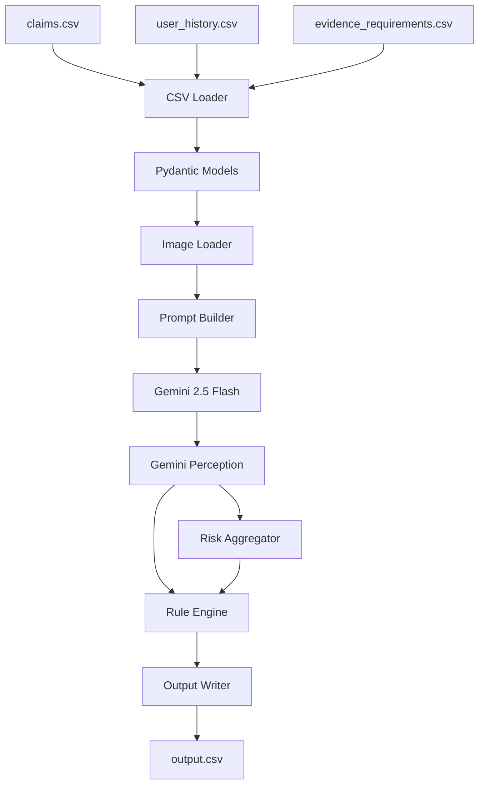

# HackerRank Orchestrate — Multi-Modal Evidence Review

A production-ready system that verifies damage claims using submitted images, claim conversations, user history, and evidence requirements.

**Supported object types:** `car`, `laptop`, `package`

---

## Table of Contents

* [Problem Statement](#problem-statement)
* [Architecture](#architecture)
* [Repository Structure](#repository-structure)
* [Setup](#setup)
* [Running the Pipeline](#running-the-pipeline)
* [Running Evaluation](#running-evaluation)
* [Output Schema](#output-schema)
* [Design Decisions](#design-decisions)
* [Known Limitations](#known-limitations)# HackerRank Orchestrate — Multi-Modal Evidence Review

A production-ready system that verifies damage claims using submitted images, claim conversations, user history, and evidence requirements.

**Supported Object Types:** `car`, `laptop`, `package`
**Hackathon:** HackerRank Orchestrate — June 2026
**Status:** ✅ Submission Ready — 44/44 claims processed

---

# Table of Contents

* [Problem Statement](#problem-statement)
* [Architecture](#architecture)
* [Key Features](#key-features)
* [Repository Structure](#repository-structure)
* [Setup](#setup)
* [Running the Pipeline](#running-the-pipeline)
* [Running Evaluation](#running-evaluation)
* [Output Schema](#output-schema)
* [Technical Decisions](#technical-decisions)
* [Known Limitations](#known-limitations)
* [Future Improvements](#future-improvements)
* [Hackathon Notes](#hackathon-notes)

---

# Problem Statement

For each claim in `dataset/claims.csv`, the system must:

1. Extract the actual damage claim from a customer support conversation.
2. Inspect one or more submitted images using a vision model (Gemini 2.5 Flash).
3. Determine whether image evidence meets the minimum evidence standard.
4. Identify the visible issue type and affected object part.
5. Classify the claim as:

   * `supported`
   * `contradicted`
   * `not_enough_information`
6. Detect image quality problems, fraud signals, and prompt injection attempts.
7. Estimate damage severity.
8. Write all results to `output.csv` using the exact required schema.

---

# Architecture

```text
claims.csv + user_history.csv + evidence_requirements.csv
                    │
                    ▼
              csv_loader
                    │
                    ▼
    Claim + UserHistory + EvidenceRequirement
            (Pydantic Models)
                    │
                    ▼
              image_loader
                    │
                    ▼
      EncodedImage List (Base64)
                    │
                    ▼
             prompt_builder
                    │
                    ▼
   System Prompt + User Prompt
                    │
                    ▼
        ┌───────────────────────┐
        │ cache_manager.check() │
        └───────┬───────┬───────┘
                │       │
             HIT│       │MISS
                │       │
                ▼       ▼
        Load Cache   Gemini Client
                        │
                        ▼
                 GeminiPerception
                        │
                        ▼
          Risk Aggregator + Rule Engine
                        │
                        ▼
                cache_manager.save()
                        │
                        ▼
                   ClaimResult
                        │
                        ▼
                  output_writer
                        │
                        ▼
                    output.csv
```

## Two-Layer Design

### Layer 1 — Gemini Perception (Vision Model)

Reports only what is visually present:

* Visible damage type and affected part
* Image quality issues
* Whether the image shows the claimed object and part
* Prompt injection detection
* Supporting image identification

### Layer 2 — Deterministic Python Rule Engine

Responsible for business decisions:

* `evidence_standard_met`
* `claim_status`
* `severity`
* `risk_flags`
* `valid_image`

---

# Key Features

## Gemini Perception Layer

* Single Gemini 2.5 Flash API call per claim
* All images submitted together as inline image parts
* Structured JSON output via:

```python
response_mime_type="application/json"
```

* Deterministic generation:

```python
temperature=0.0
```

* Automatic retry with exponential backoff on `429` and `5xx` errors

---

## Deterministic Rule Engine

* No LLM involvement in business decisions
* Fully reproducible outputs
* Stable risk-flag ordering
* Fixed severity mapping table

---

## Prompt Injection Detection

The system detects:

* Written instructions embedded in images
* Prompt injection attempts inside conversations

Flags:

* `text_instruction_present`
* `prompt_injection_detected`

The rule engine never executes instructions. It only records them.

---

## Checkpoint & Resume

* Checkpoint updated after every successful claim
* Safe recovery from:

  * Quota limits
  * Crashes
  * Network failures

Resume requires no special command:

```bash
python code/main.py
```

---

## Local Cache System

* One JSON cache file per claim
* Cache key:

```text
user_id + image_paths
```

Benefits:

* Zero Gemini cost on cache hits
* Faster execution
* Automatic cache corruption recovery

---

## Multi-Image Processing

* Multiple images processed in one Gemini request
* Independent image assessment
* Cross-image reasoning summary
* Supporting image tracking

---

# Repository Structure

```text
.
├── AGENTS.md
├── problem_statement.md
├── README.md
├── STATUS.md
├── output.csv
├── .env.example
├── requirements.txt
│
├── .cache/
│   ├── checkpoint.json
│   └── claims/
│
├── code/
│   ├── main.py
│   ├── models.py
│   ├── config.py
│   │
│   ├── services/
│   │   ├── csv_loader.py
│   │   ├── image_loader.py
│   │   ├── prompt_builder.py
│   │   ├── gemini_client.py
│   │   ├── risk_aggregator.py
│   │   ├── rule_engine.py
│   │   ├── cache_manager.py
│   │   └── output_writer.py
│   │
│   └── evaluation/
│       ├── main.py
│       ├── metrics.py
│       └── evaluation_report.md
│
└── dataset/
    ├── sample_claims.csv
    ├── claims.csv
    ├── user_history.csv
    ├── evidence_requirements.csv
    └── images/
        ├── sample/
        └── test/
```

---

# Setup

## Prerequisites

* Python 3.11+
* Gemini API Key

## Installation

```bash
git clone git@github.com:interviewstreet/hackerrank-orchestrate-june26.git

cd hackerrank-orchestrate-june26

python -m venv .venv

# Linux / macOS
source .venv/bin/activate

# Windows
.venv\Scripts\activate

pip install -r requirements.txt
```

---

## Environment Setup

```bash
cp .env.example .env
```

`.env`

```env
GEMINI_API_KEY=your_api_key_here

ENABLE_CACHE=true
CACHE_DIR=.cache
```

**Important:** Never commit `.env` to Git.

---

# Running the Pipeline

```bash
python code/main.py
```

Pipeline flow:

1. Load CSV datasets
2. Check cache
3. Load images
4. Call Gemini (cache misses only)
5. Run deterministic rule engine
6. Save cache
7. Update checkpoint
8. Generate `output.csv`

---

## Resume After Interruption

Simply rerun:

```bash
python code/main.py
```

Completed claims will be loaded from cache automatically.

---

# Running Evaluation

```bash
python code/evaluation/main.py
```

Evaluates two strategies:

### Strategy A

Production prompt

### Strategy B

Refined prompt with stricter edge-case handling

Outputs:

* Accuracy metrics
* Strategy comparison
* Winning strategy report
* Sample prediction file

---

# Output Schema

`output.csv`

| Column                       | Type   | Description                 |
| ---------------------------- | ------ | --------------------------- |
| user_id                      | string | User identifier             |
| image_paths                  | string | Image path list             |
| user_claim                   | string | Original conversation       |
| claim_object                 | string | Object type                 |
| evidence_standard_met        | bool   | Evidence requirement result |
| evidence_standard_met_reason | string | Explanation                 |
| risk_flags                   | string | Risk indicators             |
| issue_type                   | string | Visible issue               |
| object_part                  | string | Affected component          |
| claim_status                 | string | Final classification        |
| claim_status_justification   | string | Evidence explanation        |
| supporting_image_ids         | string | Supporting images           |
| valid_image                  | bool   | Image validity              |
| severity                     | string | Damage severity             |

---

# Technical Decisions

### Perception vs Decision Separation

Gemini observes.

Python decides.

Benefits:

* Auditable
* Testable
* Stable against model updates

---

### One API Call per Claim

All images submitted together.

Benefits:

* Lower latency
* Reduced API usage
* Simpler orchestration

---

### Cache-First Processing

Cache lookup occurs before image loading.

Benefits:

* No network usage
* No token cost
* Faster execution

---

### Immediate Checkpoint Updates

Checkpoint written after every claim.

Benefits:

* Crash resilience
* Zero reprocessing

---

### Canonical Risk Flag Ordering

Risk flags follow a fixed priority order.

Result:

* Deterministic output
* Easier evaluation

---

### QUOTE_ALL CSV Output

All CSV fields are quoted.

Benefits:

* Safe handling of commas
* Safe handling of newlines
* Consistent parsing

---

# Known Limitations

### Severity Depends on Gemini Accuracy

Incorrect issue classification can lead to incorrect severity.

### Multilingual Conversations

Spanish and Hindi support relies on Gemini's language understanding.

### Single Prompt Strategy

No ensemble prompting or fallback prompts.

### Deprecated SDK

Currently uses:

```python
google-generativeai
```

Future migration planned:

```python
google.genai
```

---

# Future Improvements

* Migrate to `google.genai`
* Image hash-based deduplication
* Few-shot examples per object type
* Confidence-based escalation
* Parallel claim processing
* Rate-limit-aware concurrency
* Prometheus monitoring and metrics

---

# Hackathon Notes

## One Gemini Call per Claim

All images are submitted in a single request to:

* Reduce latency
* Minimize API cost
* Preserve visual context

---

## Local Cache Prevents Duplicate Calls

Every completed claim is cached.

Production run statistics:

```text
44 Claims Processed
36 Cache Hits
8 Gemini API Calls
```

---

## Resume & Recovery

Checkpoint updates after every claim.

Recovery is automatic after:

* Quota exhaustion
* Network failure
* Unexpected termination

---

## Deterministic Business Logic

All business decisions are handled by Python.

Result:

```text
Same GeminiPerception
        ↓
Same ClaimResult
```

This guarantees reproducibility, easier debugging, and reliable resubmissions.


---

## Problem Statement

For each claim in `dataset/claims.csv`, the system:

1. Extracts the actual damage claim from a customer conversation
2. Inspects submitted images using a vision model
3. Determines whether evidence requirements are met
4. Identifies visible damage type and affected object part
5. Classifies the claim as:

   * `supported`
   * `contradicted`
   * `not_enough_information`
6. Detects image quality and fraud-related risks
7. Estimates damage severity
8. Produces a final `output.csv`

---

## Architecture



### Key Design Decisions

* Gemini performs **perception only**
* Python rule engine performs **all business decisions**
* One Gemini API call per claim
* Deterministic outputs using:

  * `temperature=0.0`
  * JSON responses
  * Rule-based post-processing

---

## Repository Structure

```text
.
├── AGENTS.md
├── problem_statement.md
├── README.md
├── STATUS.md
├── output.csv
├── .env.example
├── requirements.txt
│
├── code/
│   ├── main.py
│   ├── models.py
│   ├── config.py
│   │
│   ├── services/
│   │   ├── csv_loader.py
│   │   ├── image_loader.py
│   │   ├── prompt_builder.py
│   │   ├── gemini_client.py
│   │   ├── risk_aggregator.py
│   │   ├── rule_engine.py
│   │   └── output_writer.py
│   │
│   └── evaluation/
│       ├── main.py
│       ├── metrics.py
│       └── evaluation_report.md
│
└── dataset/
    ├── sample_claims.csv
    ├── claims.csv
    ├── user_history.csv
    ├── evidence_requirements.csv
    │
    └── images/
        ├── sample/
        └── test/
```

---

## Setup

### Prerequisites

* Python 3.11+
* Gemini API Key

### Installation

```bash
git clone git@github.com:interviewstreet/hackerrank-orchestrate-june26.git

cd hackerrank-orchestrate-june26

python -m venv .venv

source .venv/Scripts/activate

pip install -r requirements.txt
```

### Environment Variables

Create `.env`:

```env
GEMINI_API_KEY=your_api_key_here
```

**Important:** Never commit `.env` files.

---

## Running the Pipeline

```bash
python code/main.py
```

The pipeline:

1. Loads claims
2. Loads images
3. Calls Gemini
4. Runs deterministic rule engine
5. Generates `output.csv`

Example logs:

```text
=== Evidence Review Pipeline Starting ===

Loaded 46 claim(s)

[1/46] Processing claim user_002 ...

...

=== Pipeline Complete ===

Succeeded: 46
Failed: 0
```

---

## Running Evaluation

```bash
python code/evaluation/main.py
```

Outputs:

* Field-level accuracy
* Strategy comparison
* Prediction export

Generated file:

```text
code/evaluation/sample_predictions.csv
```

---

## Output Schema

| Column                       | Description             |
| ---------------------------- | ----------------------- |
| user_id                      | User identifier         |
| image_paths                  | Submitted image paths   |
| user_claim                   | Original customer claim |
| claim_object                 | car / laptop / package  |
| evidence_standard_met        | Boolean                 |
| evidence_standard_met_reason | Explanation             |
| risk_flags                   | Detected risks          |
| issue_type                   | Damage category         |
| object_part                  | Damaged component       |
| claim_status                 | Final decision          |
| claim_status_justification   | Supporting explanation  |
| supporting_image_ids         | Evidence images         |
| valid_image                  | Boolean                 |
| severity                     | Damage severity         |

### Allowed Claim Status

* `supported`
* `contradicted`
* `not_enough_information`

### Allowed Severity

* `none`
* `low`
* `medium`
* `high`
* `unknown`

---

## Design Decisions

### Separation of Perception and Decisions

Gemini identifies:

* Visible damage
* Image quality
* Potential prompt injection

The rule engine determines:

* Claim status
* Severity
* Evidence sufficiency
* Risk aggregation

This keeps the system:

* Auditable
* Reproducible
* Deterministic

---

### Single Gemini Call Per Claim

All images are submitted together using inline image parts.

Benefits:

* Lower latency
* Lower cost
* Simpler orchestration

---

### Prompt Injection Resistance

The vision model only reports detected instructions.

The rule engine ignores any instruction-like content entirely.

---

### Deterministic Output

Implemented through:

* `temperature=0.0`
* Structured JSON output
* Fixed rule evaluation
* Canonical flag ordering

---

## Known Limitations

### Severity Dependence

Severity quality depends on Gemini's visible damage detection accuracy.

### Multilingual Conversations

Spanish and Hindi conversations rely on Gemini multilingual understanding.

### No Result Caching

All claims are processed on every run.

Future optimization:

* Image hashing
* Response caching

### Single Production Strategy

No prompt ensembles or fallback prompts are currently implemented.

### SDK Migration

Current implementation uses:

```text
google-generativeai
```

Future migration target:

```text
google.genai
```
